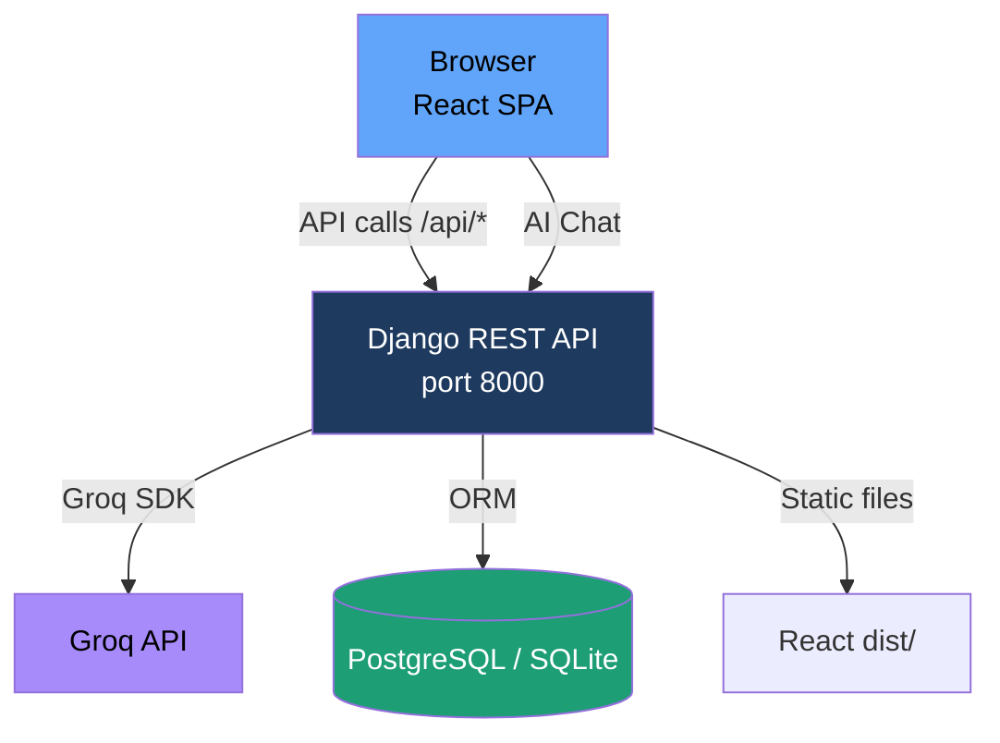
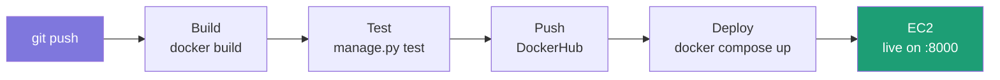

# AI-Powered Django Blog

A full-stack blogging platform with a **Django REST API** backend and a **React + TypeScript** frontend, enhanced with **Groq AI** for content recommendations, an intelligent chatbot, and automatic post tagging. Containerized with Docker and deployed via a 4-stage GitLab CI/CD pipeline.

---

## ✨ Features

| Feature | Description |
|---|---|
| 📝 Blog Posts | Create, read, and manage posts via Django Admin |
| 🤖 AI Chatbot | Floating chat widget powered by Groq — answers questions about your blog content |
| 💡 Smart Recommendations | Groq suggests related posts on every article page |
| 🏷️ Auto-Tagging | One-click AI tag generation for any post |
| 🔍 Live Search | Debounced real-time search in the navbar |
| 🌙 Beautiful Dark UI | Glassmorphism, animated hero, Framer Motion page transitions |
| 🐳 Docker Ready | Multi-stage build: React compiled in Node, served by Django + WhiteNoise |
| 🔄 CI/CD | Automated build → test → push → deploy pipeline via GitLab |

---

## 🏗️ Architecture



### CI/CD Pipeline



---

## 🛠️ Tech Stack

| Layer | Technology |
|---|---|
| Frontend | React 19, TypeScript, Vite, Framer Motion, Lucide Icons |
| Backend | Django 6.x, Django REST Framework, Python 3.13 |
| AI | Groq API with `llama-3.3-70b-versatile` (recommendations, chatbot, auto-tagging) |
| Database | PostgreSQL 15 (production), SQLite (development) |
| Containerization | Docker (multi-stage), Docker Compose |
| CI/CD | GitLab CI/CD (4 stages) |
| Registry | DockerHub |
| Cloud | AWS EC2 (Ubuntu 24.04) |

---

## ⚙️ Environment Variables

Copy `.env.example` → `.env` and fill in your values:

```bash
cp .env.example .env   # (or create .env manually)
```

| Variable | Description | Required |
|---|---|---|
| `SECRET_KEY` | Django secret key | ✅ Always |
| `DEBUG` | `True` for dev, `False` for prod | ✅ Always |
| `GROQ_API_KEY` | Groq API key for recommendations, chatbot, and auto-tagging | ✅ For AI features |
| `USE_POSTGRES` | Set `"True"` to use PostgreSQL | Production |
| `POSTGRES_DB` | Database name | Production |
| `POSTGRES_USER` | Database user | Production |
| `POSTGRES_PASSWORD` | Database password | Production |
| `POSTGRES_HOST` | Database host | Production |
| `POSTGRES_PORT` | Database port | Production |

**GitLab CI Secrets** — Set in GitLab → Settings → CI/CD → Variables:

| Variable | Purpose |
|---|---|
| `DOCKERHUB_USER` | DockerHub username |
| `DOCKERHUB_PASS` | DockerHub password / token |
| `GROQ_API_KEY` | Groq key for production container |

---

## 📁 Project Structure

```
Django-blog-cicd/
├── .gitlab-ci.yml          # CI/CD pipeline (4 stages)
├── Dockerfile              # Multi-stage: Node (React build) + Python
├── docker-compose.yaml     # Container orchestration
├── .env                    # Local secrets (git-ignored)
├── manage.py
├── requirements.txt        # Python dependencies
│
├── blogs/                  # Django project config
│   ├── settings.py         # DRF, CORS, static files, Groq API key
│   └── urls.py             # /api/* routes + React SPA catch-all
│
├── posts/                  # Blog app
│   ├── models.py           # Post model (title, body, tags, excerpt, author)
│   ├── views.py            # REST API views
│   ├── serializers.py      # DRF serializers
│   ├── ai_utils.py         # Groq AI integration
│   ├── admin.py            # Admin with AI auto-tag action
│   └── urls.py             # /api/posts/, /api/chat/, /api/search/
│
├── frontend/               # React app (Vite + TypeScript)
│   ├── src/
│   │   ├── components/     # Navbar, PostCard, Chatbot, Recommendations, TagBadge
│   │   ├── pages/          # Home, PostDetail
│   │   ├── services/api.ts # Axios API client
│   │   └── index.css       # Design system (dark theme, glassmorphism)
│   └── dist/               # Built output (served by Django, git-ignored)
│
└── templates/              # Legacy Django templates (no longer used)
```

---

## 🚀 Run Locally (Development)

### Prerequisites
- Python 3.11+ with pip
- Node 18+ with npm
- (Optional) Docker & Docker Compose for production-like setup

### 1. Backend (Django)

```bash
# Create and activate virtual environment
python -m venv .venv
source .venv/bin/activate        # Windows: .venv\Scripts\activate

# Install Python dependencies
pip install -r requirements.txt

# Configure environment
cp .env.example .env             # then edit .env and add your GROQ_API_KEY

# Run migrations
python manage.py migrate

# Create admin user
python manage.py createsuperuser

# Start Django API server
python manage.py runserver       # → http://localhost:8000
```

### 2. Frontend (React)

```bash
cd frontend

# Install npm dependencies (first time only)
npm install

# Start Vite dev server (proxies /api → localhost:8000)
npm run dev                      # → http://localhost:5173
```

Open **http://localhost:5173** to see the React app.  
Open **http://localhost:8000/admin** to manage posts.

---

## 🐳 Run with Docker Compose

```bash
# Build image (compiles React + packages Django)
docker compose build

# Start all services (Django + PostgreSQL)
docker compose up -d

# Create superuser
docker exec -it django_app python manage.py createsuperuser

# View app
open http://localhost:8000
```

The production image collects Django static files during the Docker build and serves them through WhiteNoise in the Gunicorn container. Do not mount a volume over `/app/staticfiles`, because that can hide the files collected inside the image.

### Useful Commands

```bash
docker compose logs -f            # Follow logs
docker compose down               # Stop services
docker compose down -v            # Stop + delete DB volume
docker compose restart web        # Restart Django only
docker exec -it django_app bash   # Shell into container
```

---

## 🤖 AI Features Guide

### 1. AI Chatbot
Click the **✦ floating button** (bottom-right) on any page. Ask anything:
- *"What posts do you have about Python?"*
- *"Summarize the latest article"*
- *"What topics are covered here?"*

### 2. Content Recommendations
Open any post — the sidebar shows **AI Picks for You**, 3 related posts selected by Groq based on title, tags, and content.

### 3. Auto-Tagging
On any post detail page, click **✦ AI Auto-Tag**. Groq analyzes the content and generates 3–6 relevant tags instantly.

> **For admins**: In Django Admin → Posts list, select posts and use the **🤖 Auto-tag with GROQ AI** bulk action.

---

## 🔌 API Endpoints

| Method | Endpoint | Description |
|---|---|---|
| `GET` | `/api/posts/` | List all posts |
| `GET` | `/api/posts/<id>/` | Single post detail |
| `GET` | `/api/posts/<id>/recommendations/` | AI-recommended related posts |
| `POST` | `/api/posts/<id>/autotag/` | Auto-generate tags via AI |
| `POST` | `/api/chat/` | AI chatbot (body: `{"message": "..."}`) |
| `GET` | `/api/search/?q=query` | Search posts by title, body, tags |

---

## ☁️ AWS EC2 Setup (GitLab Runner)

```bash
# Install GitLab runner on EC2
curl -L https://packages.gitlab.com/install/repositories/runner/gitlab-runner/script.deb.sh | sudo bash
sudo apt-get install gitlab-runner -y

# Install Docker & Compose plugin
sudo apt-get install docker.io docker-compose-plugin -y
sudo usermod -aG docker ubuntu
sudo usermod -aG docker gitlab-runner

# Restart runner
sudo systemctl restart gitlab-runner
```

---

## 📸 Screenshots

| Blog Home | Post Detail + AI | AI Chatbot |
|---|---|---|
| *Dark glassmorphism homepage with animated hero* | *Article with Groq recommendations sidebar* | *Floating chat widget powered by Groq* |
